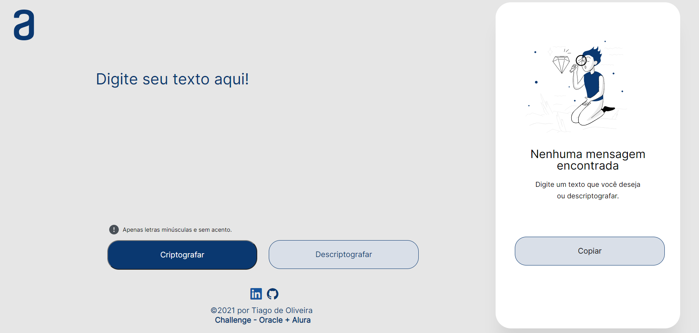

# CriptoOne

<h1 align="center">Challenge Oracle ONE - Lógica de Programação - Semanas 1 e 2 🚀</h1>

</img> 

  </a>
    <a aria-label="Dias" href="https://github.com/TI-1986/CriptoOne">
    </img>
  </a>
  
  
  
  :wrench: Used technologies:
----------------------
Here is a list of technlogies (at least what I remeber) that I used to develop the application:

- [**HTML**]
- [**CSS**]
- [**JAVASCRIPIT**]

## 🚀 Projeto

#### O CriptoOne é um projeto para Criptografar e descriptografar textos.

## Frontend

#### A Pagina
</img>
